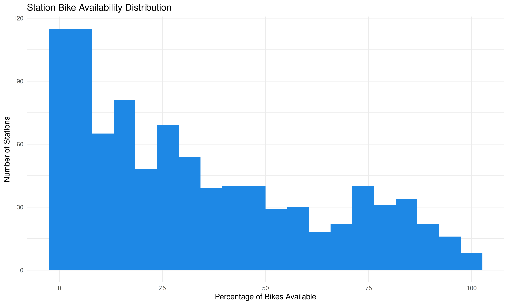

# 🚲 Toronto Bike Share Analytics

Updated: 2025-07-05 01:05

## 📊 System Overview
- **Total bikes available:** 5,977
- **Total docks available:** 10,120
- **System utilization rate:** 37.1%
- **Active stations:** 916/916

## 🏆 Top 5 Stations by Bike Availability
|Station                    | Bikes Available| Capacity|

## 🏆 Top 5 Stations by Dock Availability
|Station                                   | Docks Available| Capacity|

## 📍 Bike Locations

## 📊 Station Status Distribution

## 📈 Bike Availability Distribution

# 🚲 Toronto Bike Share Analytics

Updated: 2025-07-05 01:05

## 📊 System Overview
- **Total bikes available:** 5,977
- **Total docks available:** 10,120
- **System utilization rate:** 37.1%
- **Active stations:** 916/916

## 🏆 Top 5 Stations by Bike Availability
|:--------------------------|---------------:|--------:|

## 🏆 Top 5 Stations by Dock Availability
|:-----------------------------------------|---------------:|--------:|

## 📍 Bike Locations

## 📊 Station Status Distribution

## 📈 Bike Availability Distribution

# 🚲 Toronto Bike Share Analytics

Updated: 2025-07-05 01:05

## 📊 System Overview
- **Total bikes available:** 5,977
- **Total docks available:** 10,120
- **System utilization rate:** 37.1%
- **Active stations:** 916/916

## 🏆 Top 5 Stations by Bike Availability
|Toronto Inukshuk Park      |              44|       47|

## 🏆 Top 5 Stations by Dock Availability
|Humber Bay Shores Park / Marine Parade Dr |              55|       63|

## 📍 Bike Locations

## 📊 Station Status Distribution

## 📈 Bike Availability Distribution

# 🚲 Toronto Bike Share Analytics

Updated: 2025-07-05 01:05

## 📊 System Overview
- **Total bikes available:** 5,977
- **Total docks available:** 10,120
- **System utilization rate:** 37.1%
- **Active stations:** 916/916

## 🏆 Top 5 Stations by Bike Availability
|York St / Queens Quay W    |              43|       57|

## 🏆 Top 5 Stations by Dock Availability
|Temperance St Station                     |              52|       55|

## 📍 Bike Locations

## 📊 Station Status Distribution

## 📈 Bike Availability Distribution

# 🚲 Toronto Bike Share Analytics

Updated: 2025-07-05 01:05

## 📊 System Overview
- **Total bikes available:** 5,977
- **Total docks available:** 10,120
- **System utilization rate:** 37.1%
- **Active stations:** 916/916

## 🏆 Top 5 Stations by Bike Availability
|144 Harrison St            |              43|       51|

## 🏆 Top 5 Stations by Dock Availability
|Wellington St W / Bay St                  |              52|       55|

## 📍 Bike Locations

## 📊 Station Status Distribution

## 📈 Bike Availability Distribution

# 🚲 Toronto Bike Share Analytics

Updated: 2025-07-05 01:05

## 📊 System Overview
- **Total bikes available:** 5,977
- **Total docks available:** 10,120
- **System utilization rate:** 37.1%
- **Active stations:** 916/916

## 🏆 Top 5 Stations by Bike Availability
|Dundas St W / Crawford St  |              40|       47|

## 🏆 Top 5 Stations by Dock Availability
|Bay St / Dundas St W                      |              52|       55|

## 📍 Bike Locations

## 📊 Station Status Distribution

## 📈 Bike Availability Distribution

# 🚲 Toronto Bike Share Analytics

Updated: 2025-07-05 01:05

## 📊 System Overview
- **Total bikes available:** 5,977
- **Total docks available:** 10,120
- **System utilization rate:** 37.1%
- **Active stations:** 916/916

## 🏆 Top 5 Stations by Bike Availability
|Niagara St / Richmond St W |              39|       42|

## 🏆 Top 5 Stations by Dock Availability
|Simcoe St / Pullan Pl                     |              46|       47|

## 📍 Bike Locations

## 📊 Station Status Distribution

## 📈 Bike Availability Distribution

