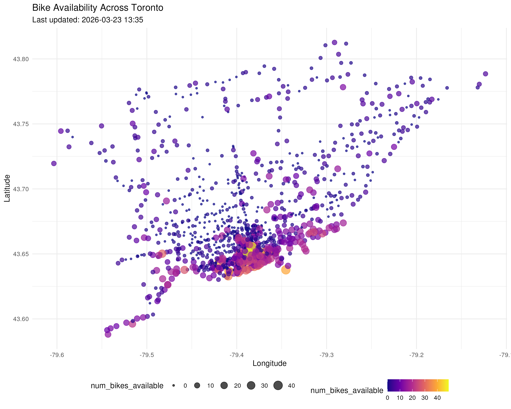
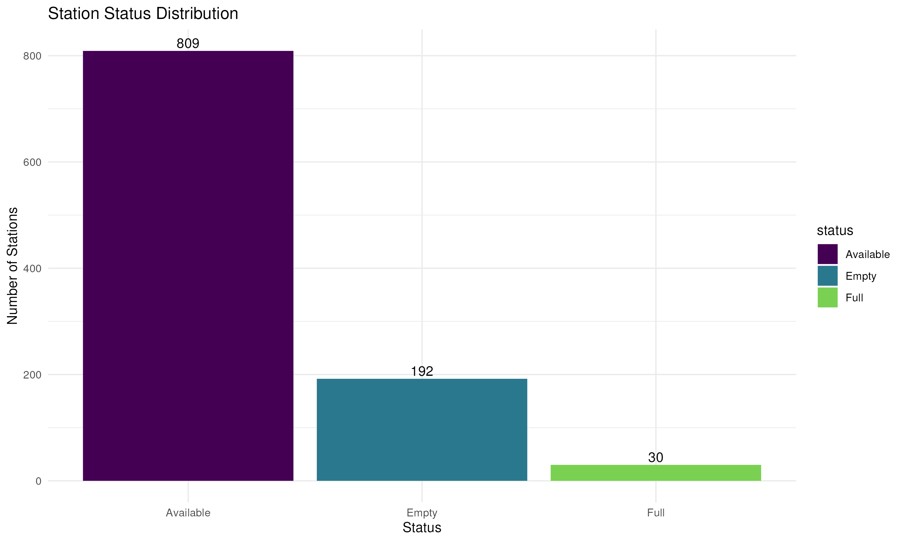
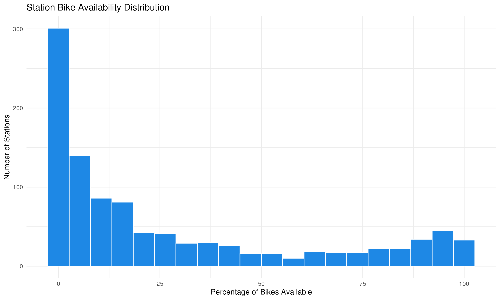
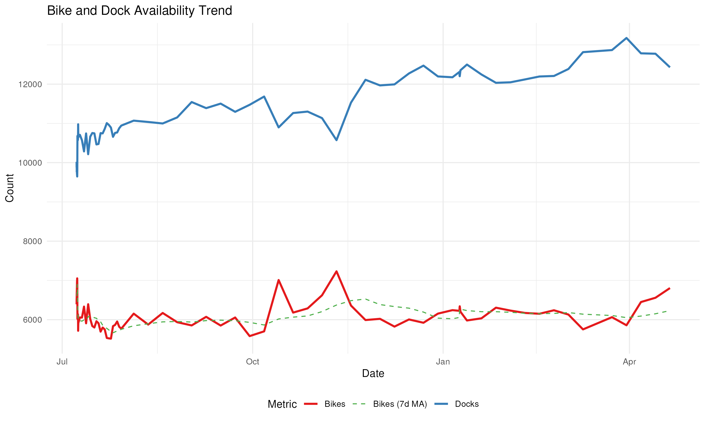
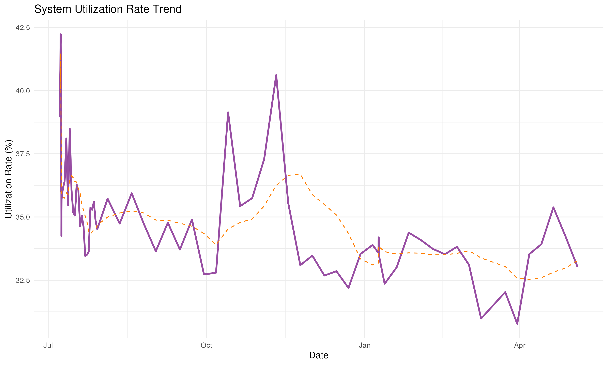

# 🚲 Toronto Bike Share Analytics

Updated: 2026-02-23 12:38 (Toronto Time)

## 📊 System Overview
| Metric | Value | Change |
|--------|-------|--------|
| **Total bikes available** | 6,239 | +89 |
| **Total docks available** | 12,208 | +13 |
| **System utilization rate** | 33.8% | +0.3% |
| **Active stations** | 1010/1010 (100%) | +1 |
| **Average bikes per station** | 6.2 | +0 |
| **Median station capacity** | 17 | - |
| **Empty stations** | 157 (15.5%) | -23 |
| **Full stations** | 18 (1.8%) | -17 |

## 🏆 Top 10 Stations by Bike Availability
| Station | Bikes Available | Capacity |
|---------|-----------------|----------|
| Simcoe St / Pullan Pl | 52 | 79 |
| York St / Queens Quay W | 42 | 57 |
| Spadina Ave / Harbord St - SMART | 36 | 36 |
| Bay St / Albert St | 35 | 62 |
| Front St W / Yonge St (Hockey Hall of Fame) | 33 | 47 |
| 285 Victoria St | 33 | 39 |
| King St W / Bay St (West Side) | 31 | 39 |
| Mill St / Cherry St | 31 | 39 |
| HTO Park West | 29 | 31 |
| Bay St / Queens Quay W (Ferry Terminal) | 28 | 35 |

## 🏆 Top 10 Stations by Dock Availability
| Station | Docks Available | Capacity |
|---------|-----------------|----------|
| Humber Bay Shores Park / Marine Parade Dr | 51 | 63 |
| Wellington St W / Bay St | 47 | 55 |
| 800 Fleet St (South) | 42 | 43 |
| 2700 Eglinton Ave W | 42 | 43 |
| 800 Fleet St (North) | 42 | 43 |
| 144 Harrison St | 40 | 51 |
| 265 Armadale Ave | 40 | 45 |
| 1 Shortt St | 39 | 39 |
| 9 Willingdon Blvd | 39 | 39 |
| Bay St / Dundas St W | 38 | 55 |

## 📊 Station Status Distribution
| Status     | Number of Stations |
|------------|-------------------:|
| Empty      | 157 |
| Full       | 18 |
| Available  | 835 |

## 📍 Bike Locations

## 📊 Station Status Distribution

## 📈 Bike Availability Distribution

## 📈 Historical Trends
### Bike and Dock Availability

### System Utilization Rate

## 📊 Sampling Methodology
The data is collected from the Toronto Bike Share GBFS API at a single point in time. This provides a snapshot of the system but may not capture temporal variations.

### Key Metrics Explained
1. **Utilization Rate**: The proportion of total bike slots that are occupied by bikes:
   $$\text{Utilization Rate} = \frac{\text{Total Bikes}}{\text{Total Bikes} + \text{Total Docks}} \times 100\%$$

2. **Station Status Classification**:
   - **Empty**: $\text{bikes} = 0$
   - **Full**: $\text{docks} = 0$
   - **Available**: $\text{bikes} > 0$ and $\text{docks} > 0$

### Statistical Notes
- The distribution of bikes across stations follows a right-skewed distribution
- The mean availability is 31.1% with a standard deviation of 28%
- The system is currently operating at 34% capacity

## ℹ️ Data Source
Data is sourced from the [Toronto Bike Share GBFS API](https://tor.publicbikesystem.net/ube/gbfs/v1/en/station_status)

## 📊 Predictive Analytics

Based on upcoming events and historical patterns, here are the predicted changes in bike demand:

### 📈 High Demand Predictions (Add Bikes)
| Station | Predicted Increase | Event Impact | Associated Event |
|---------|-------------------|--------------|------------------|
| Fort York Blvd / Capreol Ct | +25% | Concert | General prediction |
| Wellesley Station Green P | +20% | Concert | General prediction |
| St. George St / Bloor St W | +15% | Art/Cultural Event | General prediction |

### 📉 No Low Demand Predictions
No stations are predicted to have significantly decreased demand based on upcoming events.

### 📅 Upcoming Events Influencing Predictions
| Event | Date | Description | Recommended Action |
|-------|------|-------------|-------------------|
| [Concert in Trinity Bellwoods](https://www.narcity.com/example1) | 2026-02-25 | A concert in Trinity Bellwoods Park | Increase bikes nearby |
| [Food Festival at Exhibition Place](https://www.narcity.com/example2) | 2026-02-28 | Food festival at Exhibition Place | Increase bikes nearby |
| [Art Fair in Distillery District](https://www.narcity.com/example3) | 2026-03-02 | Art fair in Distillery District | Increase bikes nearby |

*Last updated: 2026-02-23 17:40 (Toronto Time)*
*Model confidence: Based on historical patterns and upcoming events from multiple RSS feeds (Narcity Toronto, View The Vibe, YYZ Deals).*
*Events analyzed: Concert in Trinity Bellwoods, Food Festival at Exhibition Place, Art Fair in Distillery District. Stations near events receive adjusted predictions.*

