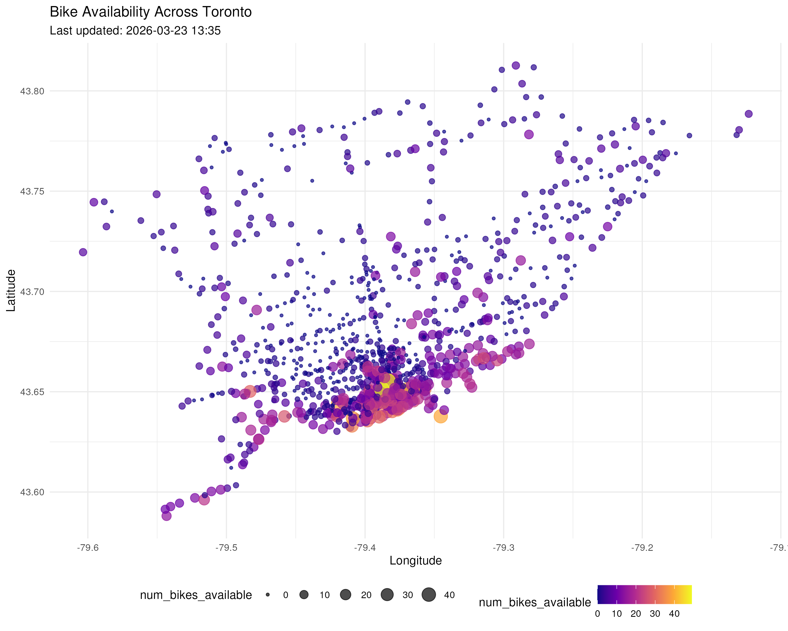
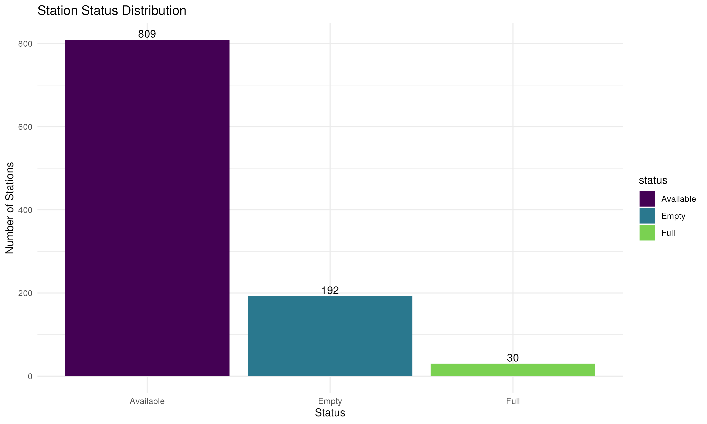
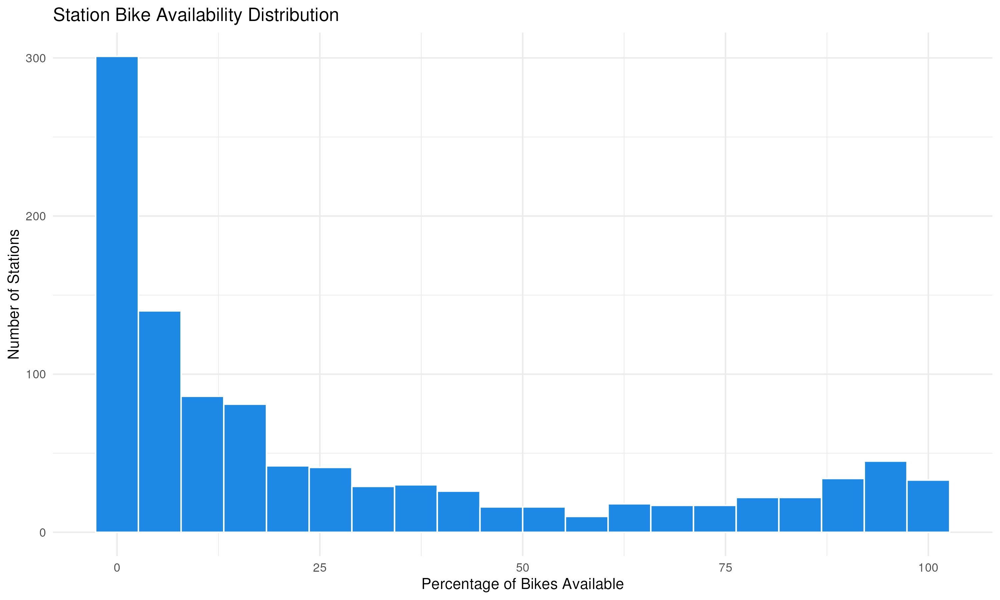
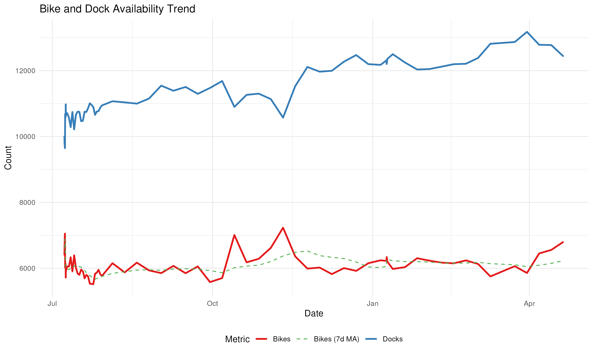
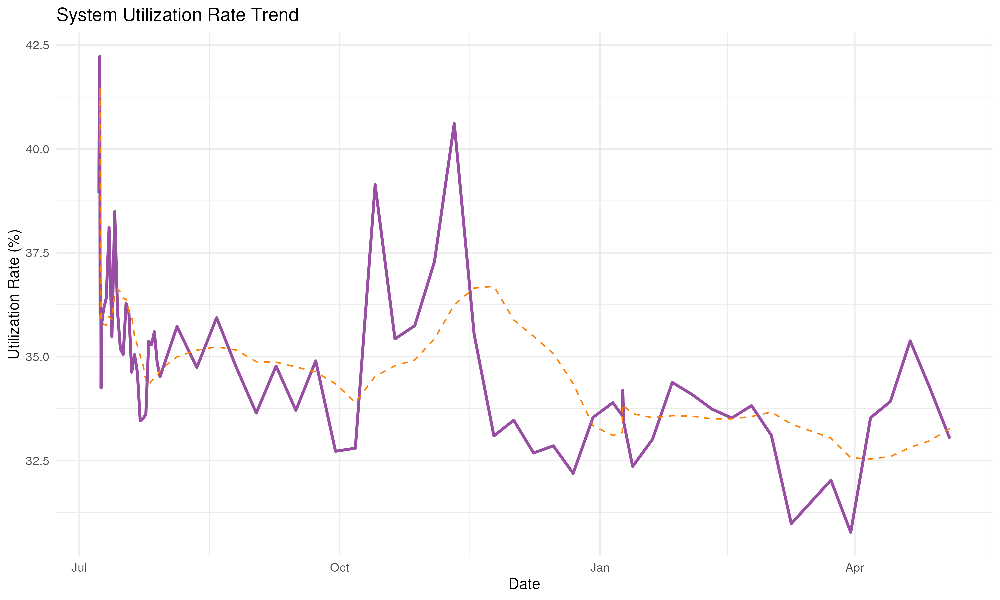

# 🚲 Toronto Bike Share Analytics

Updated: 2026-05-04 13:53 (Toronto Time)

## 📊 System Overview
| Metric | Value | Change |
|--------|-------|--------|
| **Total bikes available** | 6,209 | -284 |
| **Total docks available** | 12,591 | +120 |
| **System utilization rate** | 33% | -1.2% |
| **Active stations** | 1036/1036 (100%) | +5 |
| **Average bikes per station** | 6 | -0 |
| **Median station capacity** | 17 | - |
| **Empty stations** | 243 (23.5%) | +49 |
| **Full stations** | 39 (3.8%) | +7 |

## 🏆 Top 10 Stations by Bike Availability
| Station | Bikes Available | Capacity |
|---------|-----------------|----------|
| Toronto Inukshuk Park | 75 | 87 |
| King St E / Church St | 54 | 55 |
| Bay St / Dundas St W | 50 | 55 |
| Queens Quay E / Lower Jarvis St  | 46 | 47 |
| York St / Queens Quay W | 41 | 57 |
| Temperance St Station | 37 | 55 |
| Queens Quay / Yonge St | 37 | 47 |
| Simcoe St / Pullan Pl | 37 | 79 |
| King St W / Bay St (West Side) | 36 | 39 |
| 2700 Eglinton Ave W | 36 | 43 |

## 🏆 Top 10 Stations by Dock Availability
| Station | Docks Available | Capacity |
|---------|-----------------|----------|
| 439 Sherbourne St | 44 | 47 |
| Queen St W / Ossington Ave | 42 | 43 |
| Simcoe St / Pullan Pl | 40 | 79 |
| Jarvis St / Isabella St | 39 | 39 |
| Mill St / Cherry St | 39 | 39 |
| Fort York  Blvd / Capreol Ct | 36 | 47 |
| Bay St / Albert St | 36 | 63 |
| Wellington St W / Bay St | 36 | 55 |
| Huron St / Harbord St | 36 | 39 |
| Bathurst St / Dundas St W | 35 | 41 |

## 📊 Station Status Distribution
| Status     | Number of Stations |
|------------|-------------------:|
| Empty      | 243 |
| Full       | 38 |
| Available  | 755 |

## 📍 Bike Locations

## 📊 Station Status Distribution

## 📈 Bike Availability Distribution

## 📈 Historical Trends
### Bike and Dock Availability

### System Utilization Rate

## 📊 Sampling Methodology
The data is collected from the Toronto Bike Share GBFS API at a single point in time. This provides a snapshot of the system but may not capture temporal variations.

### Key Metrics Explained
1. **Utilization Rate**: The proportion of total bike slots that are occupied by bikes:
   $$\text{Utilization Rate} = \frac{\text{Total Bikes}}{\text{Total Bikes} + \text{Total Docks}} \times 100\%$$

2. **Station Status Classification**:
   - **Empty**: $\text{bikes} = 0$
   - **Full**: $\text{docks} = 0$
   - **Available**: $\text{bikes} > 0$ and $\text{docks} > 0$

### Statistical Notes
- The distribution of bikes across stations follows a right-skewed distribution
- The mean availability is 28.1% with a standard deviation of 30.3%
- The system is currently operating at 33% capacity

## ℹ️ Data Source
Data is sourced from the [Toronto Bike Share GBFS API](https://tor.publicbikesystem.net/ube/gbfs/v1/en/station_status)

## 📊 Predictive Analytics

Based on upcoming events and historical patterns, here are the predicted changes in bike demand:

### 📈 High Demand Predictions (Add Bikes)
| Station | Predicted Increase | Event Impact | Associated Event |
|---------|-------------------|--------------|------------------|
| Wellesley Station Green P | +34% | Concert | General prediction |
| Fort York Blvd / Capreol Ct | +22% | Concert | General prediction |
| St. George St / Bloor St W | +20% | Art/Cultural Event | General prediction |

### 📉 No Low Demand Predictions
No stations are predicted to have significantly decreased demand based on upcoming events.

### 📅 Upcoming Events Influencing Predictions
| Event | Date | Description | Recommended Action |
|-------|------|-------------|-------------------|
| [Concert in Trinity Bellwoods](https://www.narcity.com/example1) | 2026-05-06 | A concert in Trinity Bellwoods Park | Increase bikes nearby |
| [Food Festival at Exhibition Place](https://www.narcity.com/example2) | 2026-05-09 | Food festival at Exhibition Place | Increase bikes nearby |
| [Art Fair in Distillery District](https://www.narcity.com/example3) | 2026-05-11 | Art fair in Distillery District | Increase bikes nearby |

*Last updated: 2026-05-04 17:54 (Toronto Time)*
*Model confidence: Based on historical patterns and upcoming events from multiple RSS feeds (Narcity Toronto, View The Vibe, YYZ Deals).*
*Events analyzed: Concert in Trinity Bellwoods, Food Festival at Exhibition Place, Art Fair in Distillery District. Stations near events receive adjusted predictions.*

