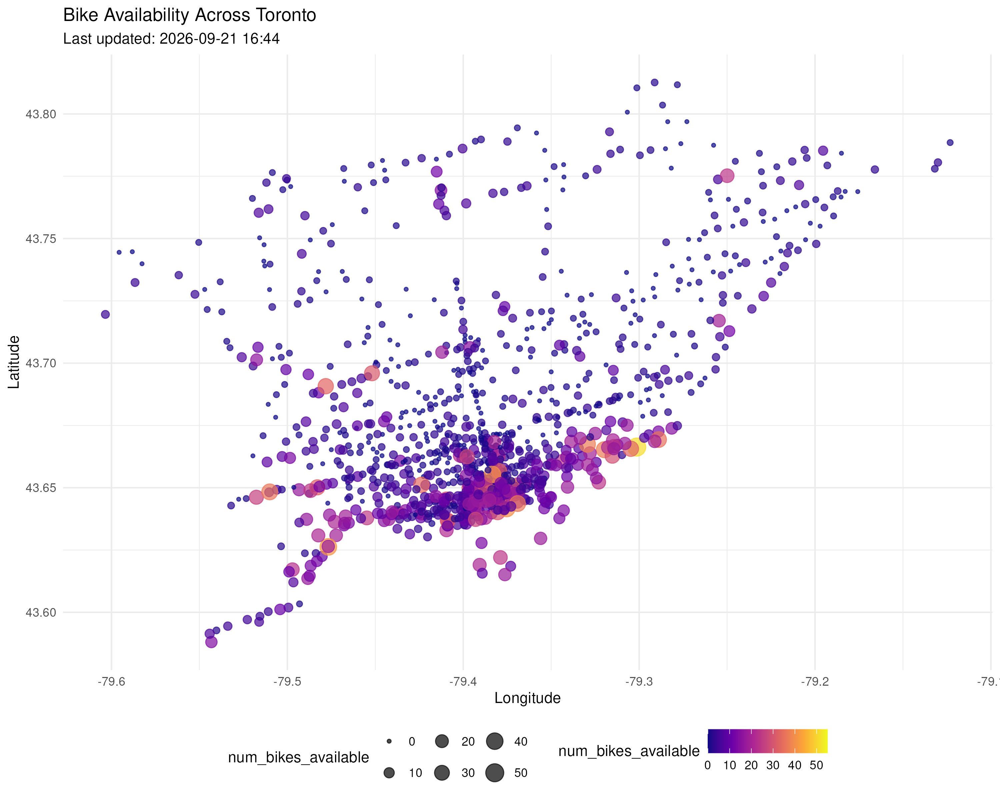
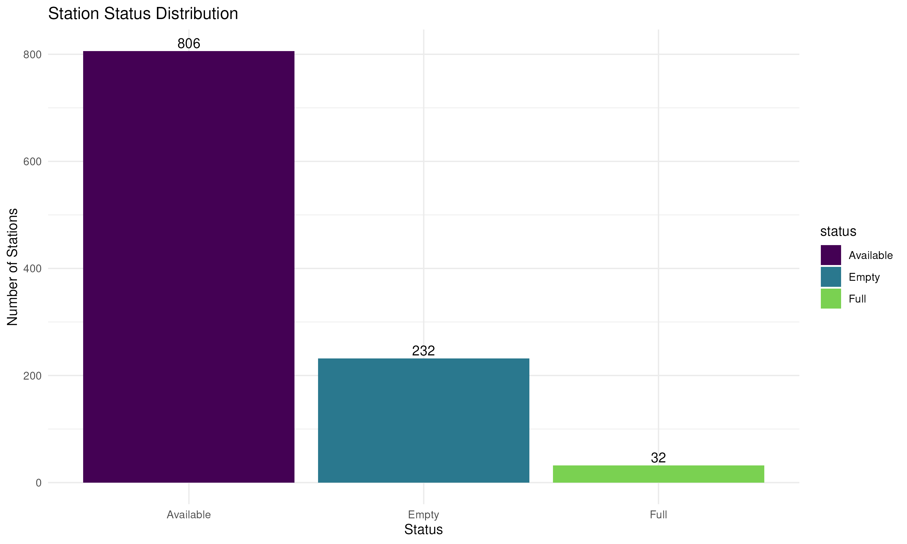
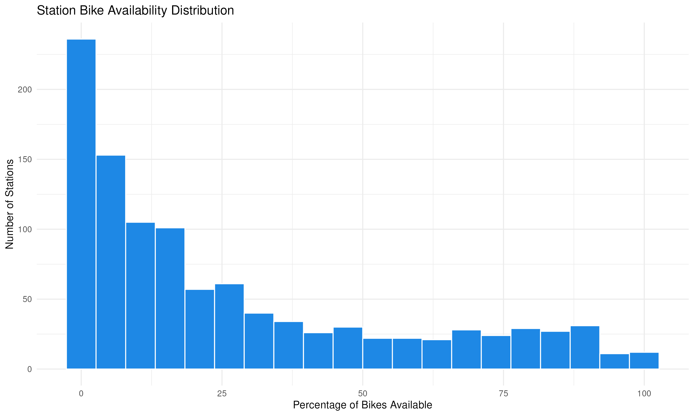
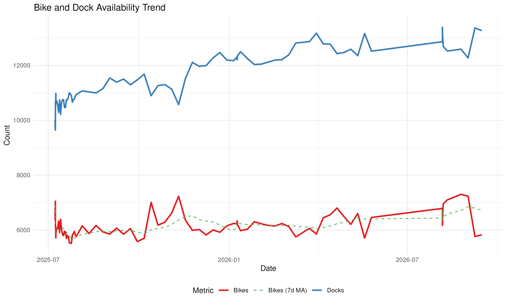
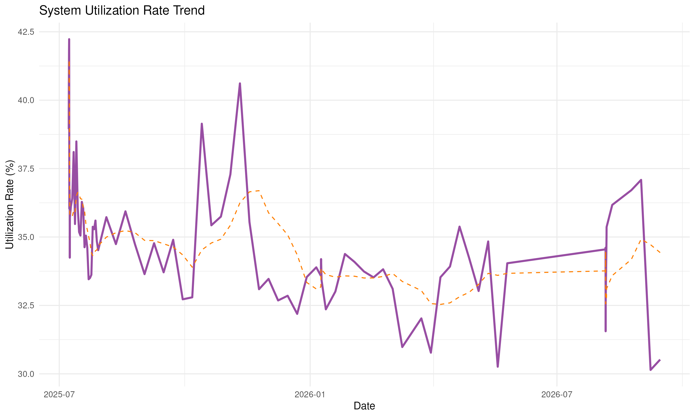

# 🚲 Toronto Bike Share Analytics

Updated: 2026-08-05 16:05 (Toronto Time)

## 🖥️ Live Dashboard
View the interactive dashboard with the full history of bike availability: [https://bryanpaget.github.io/toronto-bikeshare/](https://bryanpaget.github.io/toronto-bikeshare/)

## 📊 System Overview
| Metric | Value | Change |
|--------|-------|--------|
| **Total bikes available** | 6,797 | +17 |
| **Total docks available** | 12,842 | -15 |
| **System utilization rate** | 34.6% | +0.1% |
| **Active stations** | 1056/1056 (100%) |  |
| **Average bikes per station** | 6.4 | +0 |
| **Median station capacity** | 17 | - |
| **Empty stations** | 237 (22.4%) | -1 |
| **Full stations** | 32 (3%) | +1 |

## 🏆 Top 10 Stations by Bike Availability
| Station | Bikes Available | Capacity |
|---------|-----------------|----------|
| Kewbeach Ave / Kenilworth Ave | 60 | 61 |
| Humber Bay Shores Park / Marine Parade Dr | 56 | 63 |
| King St E / Church St | 55 | 55 |
| York St / Queens Quay W | 50 | 57 |
| Temperance St Station | 48 | 55 |
| Simcoe St / Pullan Pl | 47 | 79 |
| Queens Quay / Yonge St | 43 | 47 |
| Frederick St / King St E | 43 | 47 |
| Bay St / Dundas St W | 43 | 55 |
| Bay St / Albert St | 42 | 63 |

## 🏆 Top 10 Stations by Dock Availability
| Station | Docks Available | Capacity |
|---------|-----------------|----------|
| Toronto Inukshuk Park | 79 | 87 |
| Cherry Beach | 46 | 49 |
| Fort York  Blvd / Capreol Ct | 41 | 47 |
| Bloor St W / Manning Ave - SMART | 40 | 42 |
| Bathurst St / Dundas St W | 39 | 41 |
| 439 Sherbourne St | 35 | 47 |
| Lake Shore Blvd W / Ontario Dr | 33 | 35 |
| Mill St / Cherry St | 32 | 39 |
| Yonge St / Orchard View Blvd | 32 | 35 |
| Lisgar Park | 32 | 35 |

## 📊 Station Status Distribution
| Status     | Number of Stations |
|------------|-------------------:|
| Empty      | 237 |
| Full       | 32 |
| Available  | 787 |

## 📍 Bike Locations

## 📊 Station Status Distribution

## 📈 Bike Availability Distribution

## 📈 Historical Trends
### Bike and Dock Availability

### System Utilization Rate

## 📊 Sampling Methodology
The data is collected from the Toronto Bike Share GBFS API at a single point in time. This provides a snapshot of the system but may not capture temporal variations.

### Key Metrics Explained
1. **Utilization Rate**: The proportion of total bike slots that are occupied by bikes:
   $$\text{Utilization Rate} = \frac{\text{Total Bikes}}{\text{Total Bikes} + \text{Total Docks}} \times 100\%$$

2. **Station Status Classification**:
   - **Empty**: $\text{bikes} = 0$
   - **Full**: $\text{docks} = 0$
   - **Available**: $\text{bikes} > 0$ and $\text{docks} > 0$

### Statistical Notes
- The distribution of bikes across stations follows a right-skewed distribution
- The mean availability is 29.3% with a standard deviation of 30.8%
- The system is currently operating at 35% capacity

## ℹ️ Data Source
Data is sourced from the [Toronto Bike Share GBFS API](https://tor.publicbikesystem.net/ube/gbfs/v1/en/station_status)

## 📊 Predictive Analytics

Based on upcoming events and historical patterns, here are the predicted changes in bike demand:

### 📈 High Demand Predictions (Add Bikes)
| Station | Predicted Increase | Event Impact | Associated Event |
|---------|-------------------|--------------|------------------|
| Simcoe St / Pullan Pl | +30% | Concert | How to find a good hotel deal in Toronto using Skyscanner |

### 📉 No Low Demand Predictions
No stations are predicted to have significantly decreased demand based on upcoming events.

### 📅 Upcoming Events Influencing Predictions
| Event | Date | Description | Recommended Action |
|-------|------|-------------|-------------------|
| [How to find a good hotel deal in Toronto using Skyscanner](https://viewthevibe.com/how-to-find-a-good-hotel-deal-in-toronto-using-skyscanner/) | 2026-08-06 | 
Booking a hotel in Toronto isn’t difficult i... | Monitor usage |
| [Yes, another Toronto festival. But this one actually gets what people want.](https://viewthevibe.com/yes-another-toronto-festival-but-this-one-actually-gets-what-people-want/) | 2026-08-06 | 
Discover the unique experience at the On the... | Increase bikes nearby |
| [Singer Olivia Dean went to this popular Toronto bar after her concert](https://www.blogto.com/eat_drink/2026/08/olivia-dean-spotted-toronto-bar/) | 2026-08-06 | <img class="webfeedsFeaturedVisual" src="https:... | Increase bikes nearby |
| [15 things to do in Toronto this weekend](https://www.blogto.com/radar/2026/08/things-do-toronto-weekend-aug-5/) | 2026-08-06 | <img class="webfeedsFeaturedVisual" src="https:... | Increase bikes nearby |

*Last updated: 2026-08-05 16:06 (Toronto Time)*
*Model confidence: Based on historical patterns and upcoming events from multiple RSS feeds (Narcity Toronto, View The Vibe, YYZ Deals).*
*Events analyzed: How to find a good hotel deal in Toronto using Skyscanner, Yes, another Toronto festival. But this one actually gets what people want., Singer Olivia Dean went to this popular Toronto bar after her concert.... Stations near events receive adjusted predictions.*

