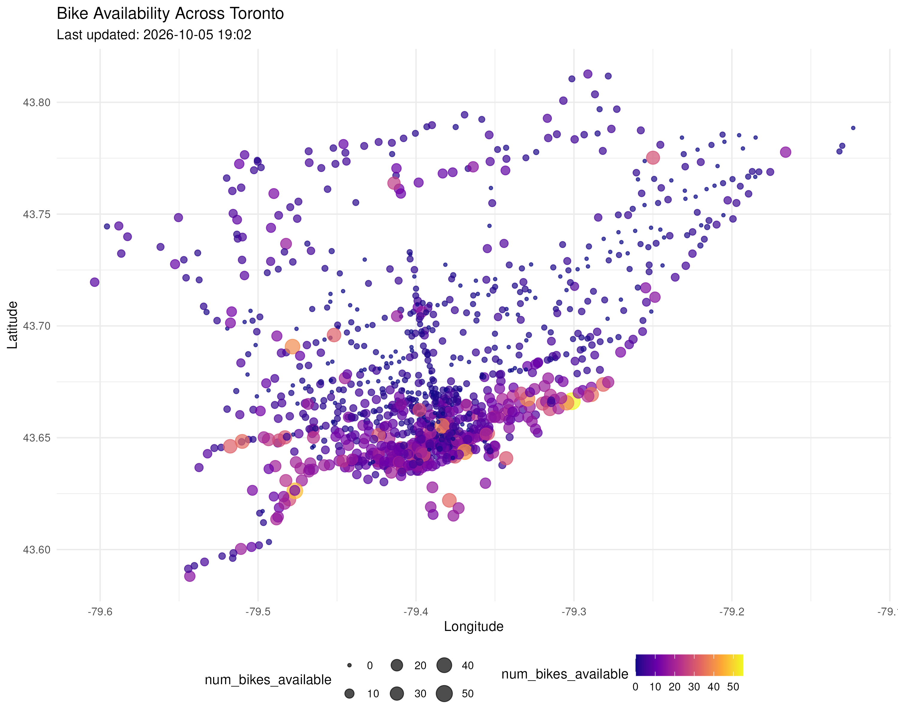
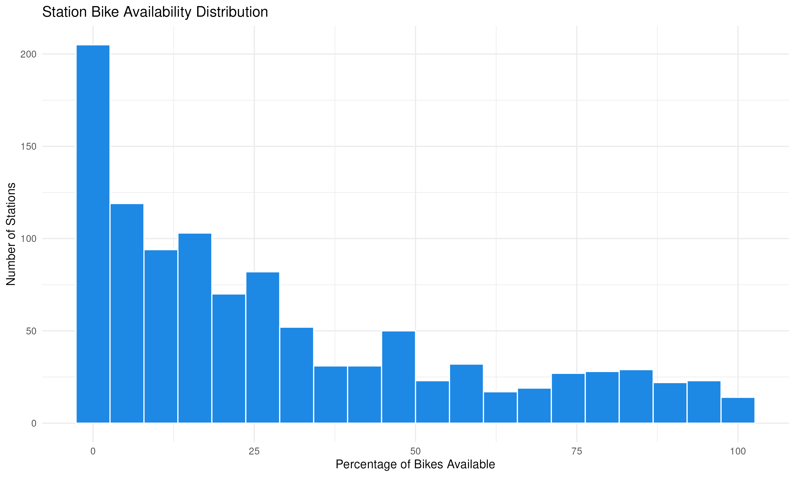
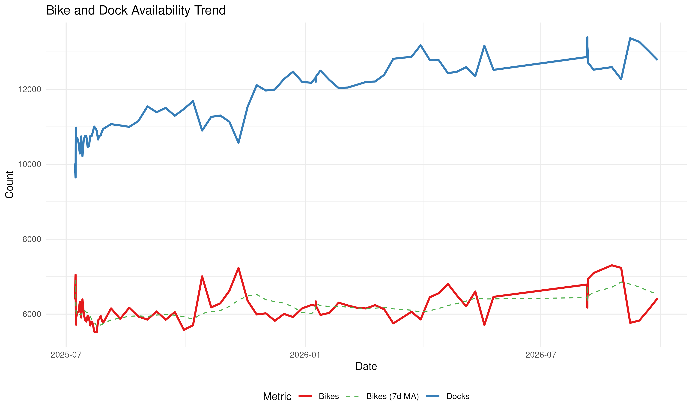
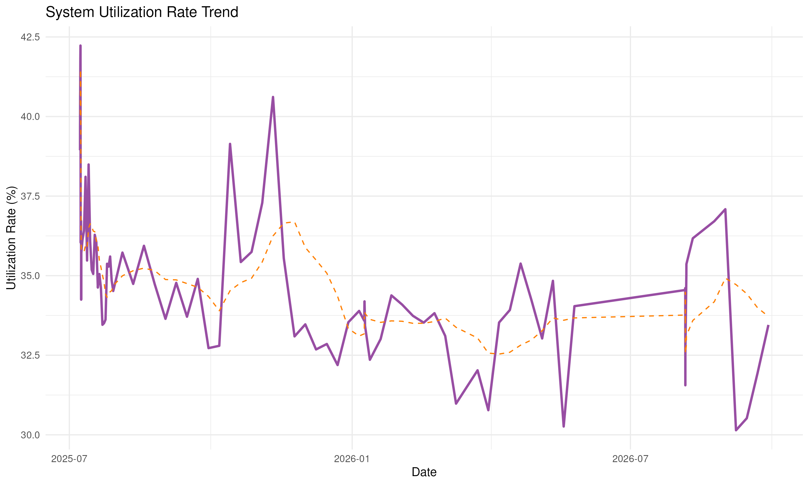

# 🚲 Toronto Bike Share Analytics

Updated: 2026-09-28 18:22 (Toronto Time)

## 🖥️ Live Dashboard
View the interactive dashboard with the full history of bike availability: [https://bryanpaget.github.io/toronto-bikeshare/](https://bryanpaget.github.io/toronto-bikeshare/)

## 📊 System Overview
| Metric | Value | Change |
|--------|-------|--------|
| **Total bikes available** | 6,424 | +310 |
| **Total docks available** | 12,779 | -249 |
| **System utilization rate** | 33.5% | +1.5% |
| **Active stations** | 1071/1071 (100%) | +1 |
| **Average bikes per station** | 6 | +0 |
| **Median station capacity** | 17 | - |
| **Empty stations** | 204 (19%) | -28 |
| **Full stations** | 39 (3.6%) | +7 |

## 🏆 Top 10 Stations by Bike Availability
| Station | Bikes Available | Capacity |
|---------|-----------------|----------|
| King St E / Church St | 53 | 55 |
| Toronto Inukshuk Park | 52 | 87 |
| Humber Bay Shores Park / Marine Parade Dr | 50 | 63 |
| Kewbeach Ave / Kenilworth Ave | 49 | 61 |
| Queens Quay / Yonge St | 43 | 47 |
| Northern Dancer Blvd / Lake Shore Blvd E | 40 | 41 |
| Alton Ave / Dundas St E (Greenwood Park) | 39 | 41 |
| 100 Grangeway Ave  | 38 | 39 |
| Hubbard Blvd / Balsam Av | 37 | 39 |
| Aitken Place Park | 36 | 39 |

## 🏆 Top 10 Stations by Dock Availability
| Station | Docks Available | Capacity |
|---------|-----------------|----------|
| Simcoe St / Pullan Pl | 76 | 79 |
| Bay St / Albert St | 44 | 63 |
| Wellington St W / Bay St | 44 | 55 |
| York St / Queens Quay W | 41 | 57 |
| Bathurst St / Dundas St W | 38 | 41 |
| Temperance St Station | 37 | 55 |
| Frederick St / King St E | 36 | 47 |
| 91 Via Italia | 36 | 39 |
| Huron St / Harbord St | 35 | 39 |
| 439 Sherbourne St | 35 | 47 |

## 📊 Station Status Distribution
| Status     | Number of Stations |
|------------|-------------------:|
| Empty      | 204 |
| Full       | 39 |
| Available  | 828 |

## 📍 Bike Locations

## 📈 Bike Availability Distribution

## 📈 Historical Trends
### Bike and Dock Availability

### System Utilization Rate

## 📊 Sampling Methodology
The data is collected from the Toronto Bike Share GBFS API at a single point in time. This provides a snapshot of the system but may not capture temporal variations.

### Key Metrics Explained
1. **Utilization Rate**: The proportion of total bike slots that are occupied by bikes:
   $$\text{Utilization Rate} = \frac{\text{Total Bikes}}{\text{Total Bikes} + \text{Total Docks}} \times 100\%$$

2. **Station Status Classification**:
   - **Empty**: $\text{bikes} = 0$
   - **Full**: $\text{docks} = 0$
   - **Available**: $\text{bikes} > 0$ and $\text{docks} > 0$

### Statistical Notes
- The distribution of bikes across stations follows a right-skewed distribution
- The mean availability is 28.9% with a standard deviation of 28.6%
- The system is currently operating at 33% capacity

## ℹ️ Data Source
Data is sourced from the [Toronto Bike Share GBFS API](https://tor.publicbikesystem.net/ube/gbfs/v1/en/station_status)

## 🚴 About Bike Share Toronto
Bike Share Toronto is the city's public bike share system, owned and operated by the Toronto Parking Authority. It launched in May 2011 as Bixi Toronto with about 1,000 bikes and 80 stations, and was rebranded as Bike Share Toronto when the Toronto Parking Authority took over operations in 2014. Today it has grown to more than 1,000 stations and 10,000+ bikes (including roughly 2,100 electric bikes) across the city.

The system has expanded rapidly alongside the city's cycling network. Annual ridership grew from about 2.9 million trips in 2020 to 5.7 million in 2023, 7.0 million in 2024, and a record 7.8 million trips in 2025 — with continued growth expected in 2026 as more e-bikes, charging docks, and stations are added.

The city's 2030 Growth Strategy (Ride More, Connect More) lays out a roadmap for roughly doubling the network, integrating bike share more closely with transit, and expanding into underserved neighbourhoods. Equity programs such as the Reduced Fare Pass make the system more affordable, and expansion priorities are informed by research on how to make bike share reach more residents in lower-income areas.

- Official site: [bikesharetoronto.com](https://bikesharetoronto.com/)
- Overview & history: [Wikipedia - Bike Share Toronto](https://en.wikipedia.org/wiki/Bike_Share_Toronto)
- City of Toronto: [Toronto Parking Authority - 2030 Growth Strategy (PDF)](https://www.toronto.ca/legdocs/mmis/2025/pa/bgrd/backgroundfile-260875.pdf)

## 🚲 Bike Share Across Canada and the World
Toronto is part of a growing network of public bike share systems. Montreal's BIXI (2009) was the first modern public bike share in North America, and other major Canadian systems include Vancouver's Mobi by Shaw Go (2016) and Hamilton's bike share (2015). Internationally, the well-known systems include Paris' Vélib', London's Santander Cycles, New York's Citi Bike, and Washington D.C.'s Capital Bikeshare. Hundreds of cities worldwide now operate docked or dockless bike share programs as part of their urban mobility toolkit.

## 🌍 Why Bike Share Matters for Cities
Bike share systems deliver a broad set of benefits for cities and their residents:
1. **First- and last-mile connections**: Bike share fills the gap between transit stops (GO, TTC,    and regional rail) and people's homes, workplaces, and errands, extending the reach of public    transit without large capital investment.
2. **Less congestion**: Short car trips can be replaced by bikes, easing road congestion. Research    on Washington D.C.'s Capital Bikeshare estimated it reduced neighbourhood-level traffic    congestion by up to 4% (Hamilton & Wichman, 2018).
3. **Health benefits**: Bike share encourages everyday physical activity. A study of European    bike share systems estimated that, if all bike share trips replaced car trips, up to 73    deaths could be prevented each year across those cities — and benefits outweigh risks in    every scenario considered (Otero, Nieuwenhuijsen & Rojas-Rueda, 2018).
4. **Lower emissions**: Replacing car trips reduces greenhouse gas emissions and local air    pollution, supporting municipal climate and Vision Zero goals.
5. **Equitable, affordable mobility**: At low cost, bike share provides flexible mobility to    residents who may not own a bike or a car, and targeted pricing and station placement can    address transportation inequity in lower-income neighbourhoods (see TMU research below).
6. **Efficient use of public space**: A single bike lane or docked station moves many more    people per hour than the equivalent car parking, making better use of valuable street space.

## 📚 Research & Further Reading
- **Health impacts of bike share** — Otero, I., Nieuwenhuijsen, M.J. & Rojas-Rueda, D. (2018).   *Health impacts of bike sharing systems in Europe*. Environment International, 115, 387-394.   [https://doi.org/10.1016/j.envint.2018.04.014](https://doi.org/10.1016/j.envint.2018.04.014)
- **Congestion reduction** — Hamilton, T.L. & Wichman, C.J. (2018). *Bicycle infrastructure and   traffic congestion: Evidence from DC's Capital Bikeshare*. Journal of Environmental Economics   and Management, 87, 72-93. [https://doi.org/10.1016/j.jeem.2017.03.007](https://doi.org/10.1016/j.jeem.2017.03.007)
- **Review of the bike share literature** — Fishman, E., Washington, S. & Haworth, N. (2013).   *Bike Share: A Synthesis of the Literature*. Transport Reviews, 33(2), 148-165.   [https://doi.org/10.1080/01441647.2013.775612](https://doi.org/10.1080/01441647.2013.775612)
- **Equity in Toronto's bike share** — Mekonnen, S. (2022). *A Plan for an Equitable Expansion of   Bike Share Toronto* (Toronto Metropolitan University).   [https://doi.org/10.32920/17329601](https://doi.org/10.32920/17329601)

## 🤝 Canadian Cycling & Urban Associations
- **Vélo Canada Bikes** — Canada's national cycling advocacy organization.   [https://velocanadabikes.org](https://velocanadabikes.org/)
- **Cycle Toronto** — Toronto's member-supported cycling advocacy charity, promotes safe cycling   across the city. [https://www.cycleto.ca](https://www.cycleto.ca/)
- **Share the Road Cycling Coalition** — Ontario-wide coalition working with municipalities on   cycling infrastructure and policy. [https://sharetheroad.ca](https://sharetheroad.ca/)
- **Transportation Association of Canada (TAC)** — National association producing guides and   standards for sustainable transportation and active mobility.   [https://www.tac-atc.ca](https://www.tac-atc.ca/en)
- **City of Toronto - Cycling** — City cycling network, maps, and programs.   [https://www.toronto.ca/cycling](https://www.toronto.ca/services-payments/streets-parking-transportation/cycling-in-toronto/)
- **Toronto Metropolitan University - School of Urban & Regional Planning / City Building** —   Research on urban mobility, transit, and city planning.   [https://www.torontomu.ca/city-building](https://www.torontomu.ca/city-building/)

## 📊 Predictive Analytics

Based on upcoming events and historical patterns, here are the predicted changes in bike demand:

### 📈 High Demand Predictions (Add Bikes)
| Station | Predicted Increase | Event Impact | Associated Event |
|---------|-------------------|--------------|------------------|
| Humber Bay Shores Park / Marine Parade Dr | +28% | Sports Event | General prediction |
| Toronto Inukshuk Park | +25% | Sports Event | 'Game-changer': After landing McKenna, new-look Maple Leafs eyeing quick rebound |
| Kewbeach Ave / Kenilworth Ave | +22% | Sports Event | General prediction |
| Simcoe St / Pullan Pl | +20% | Food Festival | 'Game-changer': After landing McKenna, new-look Maple Leafs eyeing quick rebound |
| Bay St / Albert St | +20% | Sports Event | 'Game-changer': After landing McKenna, new-look Maple Leafs eyeing quick rebound |

### 📉 No Low Demand Predictions
No stations are predicted to have significantly decreased demand based on upcoming events.

### 📅 Upcoming Events Influencing Predictions
| Event | Date | Description | Recommended Action |
|-------|------|-------------|-------------------|
| ['Game-changer': After landing McKenna, new-look Maple Leafs eyeing quick rebound](https://www.narcity.com/toronto/maple-leafs-looking-to-rebound-after-ugly-season) | 2026-09-29 | William Nylander was hanging out up top in a pr... | Increase bikes nearby |
| [This real-life Hallmark town 1 hour from Toronto has cozy cafes and endless autumn charm](https://www.narcity.com/toronto/small-town-near-toronto-port-perry-fall-things-to-do-hallmark-movie) | 2026-09-28 | You don't have to go far from Toronto to feel l... | Increase bikes nearby |
| [Former Toronto Raptors star Brandon Ingram has a serious injury](https://www.blogto.com/sports_play/2026/09/former-toronto-raptors-brandon-ingram-injury/) | 2026-09-29 | It seems the Toronto Raptors may have dodged a ... | Increase bikes nearby |
| [What Kawhi Leonard said about his iconic laugh in return to Toronto](https://www.blogto.com/sports_play/2026/09/raptors-kawhi-leonard-laugh/) | 2026-09-29 | Hundreds of media members packed Toronto's Hote... | Increase bikes nearby |
| [Canada issues urgent new warning for travellers headed to Mexico](https://www.blogto.com/travel/2026/09/canada-urgent-warning-travel-mexico/) | 2026-09-29 | Canadian travellers with upcoming trips to Mexi... | Increase bikes nearby |
| [Toronto's iconic Distillery Winter Village 2026 returns this November](https://www.blogto.com/radar/2026/09/toronto-distillery-winter-village-returns-2026/) | 2026-09-29 | Nothing marks the start of the holiday season q... | Increase bikes nearby |

*Last updated: 2026-09-28 22:23 (Toronto Time)*
*Model confidence: Based on historical patterns and upcoming events from multiple RSS feeds (Narcity Toronto, View The Vibe, YYZ Deals).*
*Events analyzed: 'Game-changer': After landing McKenna, new-look Maple Leafs eyeing quick rebound, This real-life Hallmark town 1 hour from Toronto has cozy cafes and endless autumn charm, Former Toronto Raptors star Brandon Ingram has a serious injury.... Stations near events receive adjusted predictions.*

