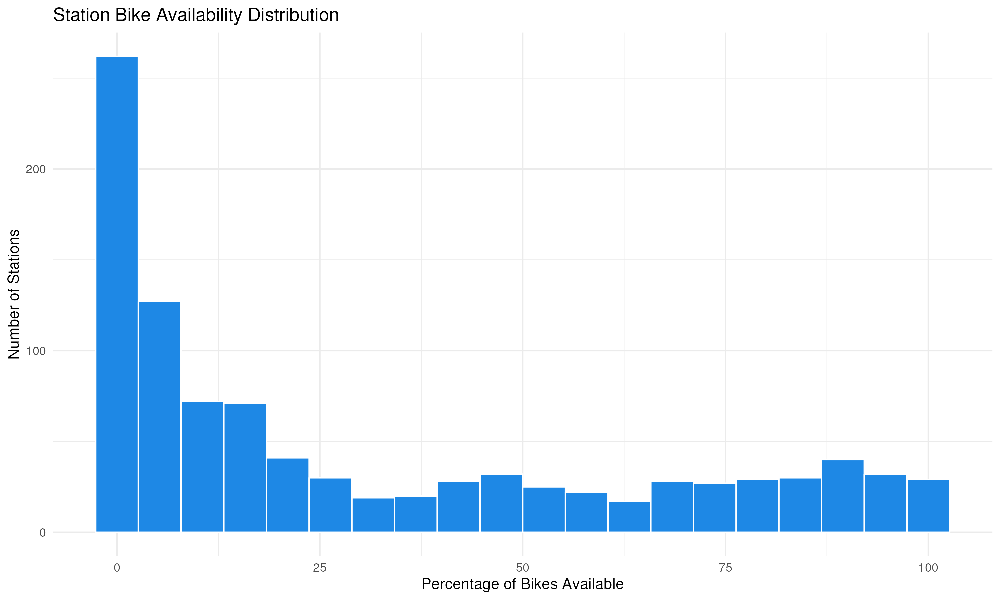

# 🚲 Toronto Bike Share Analytics

Updated: 2025-10-20 13:08 (Toronto Time)

## 📊 System Overview
| Metric | Value | Change |
|--------|-------|--------|
| **Total bikes available** | 6,180 | -829 |
| **Total docks available** | 11,264 | +366 |
| **System utilization rate** | 35.4% | -3.7% |
| **Active stations** | 982/982 (100%) | -7 |
| **Average bikes per station** | 6.3 | -1 |
| **Median station capacity** | 17 | - |
| **Empty stations** | 227 (23.1%) | +73 |
| **Full stations** | 61 (6.2%) | +8 |

## 🏆 Top 10 Stations by Bike Availability
| Station | Bikes Available | Capacity |
|---------|-----------------|----------|
| Bay St / Albert St | 59 | 63 |
| Humber Bay Shores Park / Marine Parade Dr | 54 | 63 |
| York St / Queens Quay W | 50 | 57 |
| Bay St / Dundas St W | 50 | 55 |
| Wellington St W / Bay St | 49 | 55 |
| Front St W / Yonge St (Hockey Hall of Fame) | 46 | 47 |
| Cherry Beach | 46 | 49 |
| Queens Quay / Yonge St | 45 | 47 |
| Temperance St Station | 40 | 55 |
| Frederick St / King St E | 40 | 47 |

## 🏆 Top 10 Stations by Dock Availability
| Station | Docks Available | Capacity |
|---------|-----------------|----------|
| Fort York  Blvd / Capreol Ct | 44 | 47 |
| Dundas St W / Crawford St | 42 | 47 |
| Toronto Inukshuk Park | 42 | 47 |
| Bloor St W / Manning Ave - SMART | 39 | 42 |
| Balliol St / Yonge St - SMART | 36 | 36 |
| Niagara St / Richmond St W | 35 | 42 |
| Lisgar Park | 34 | 35 |
| Yonge St / Orchard View Blvd | 33 | 35 |
| Berkeley St / Dundas St E - SMART | 33 | 40 |
| Brimley Rd / Lawrence Ave E  | 33 | 39 |

## 📊 Station Status Distribution
| Status     | Number of Stations |
|------------|-------------------:|
| Empty      | 227 |
| Full       | 61 |
| Available  | 694 |

## 📍 Bike Locations

## 📊 Station Status Distribution

## 📈 Bike Availability Distribution

## 📈 Historical Trends
### Bike and Dock Availability

### System Utilization Rate

## 📊 Sampling Methodology
The data is collected from the Toronto Bike Share GBFS API at a single point in time. This provides a snapshot of the system but may not capture temporal variations.

### Key Metrics Explained
1. **Utilization Rate**: The proportion of total bike slots that are occupied by bikes:
   $$\text{Utilization Rate} = \frac{\text{Total Bikes}}{\text{Total Bikes} + \text{Total Docks}} \times 100\%$$

2. **Station Status Classification**:
   - **Empty**: $\text{bikes} = 0$
   - **Full**: $\text{docks} = 0$
   - **Available**: $\text{bikes} > 0$ and $\text{docks} > 0$

### Statistical Notes
- The distribution of bikes across stations follows a right-skewed distribution
- The mean availability is 30.5% with a standard deviation of 32.6%
- The system is currently operating at 35% capacity

## ℹ️ Data Source
Data is sourced from the [Toronto Bike Share GBFS API](https://tor.publicbikesystem.net/ube/gbfs/v1/en/station_status)
