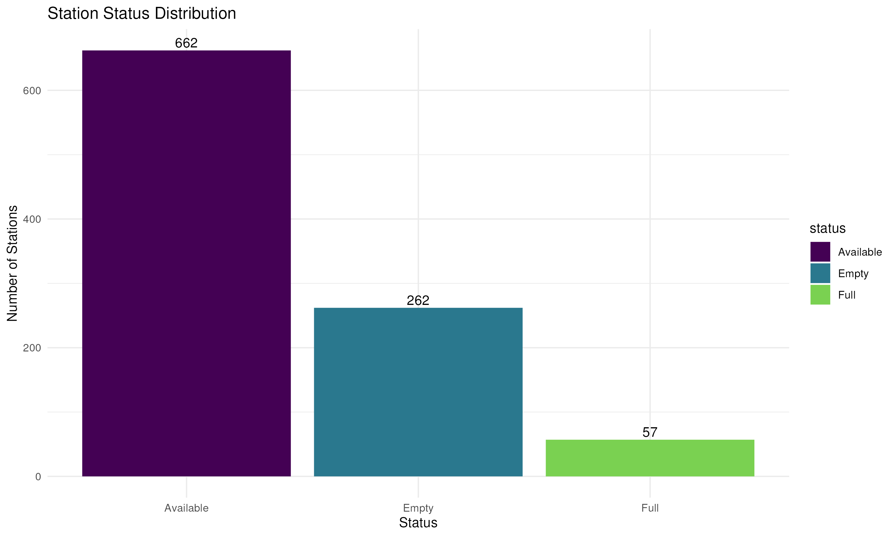

# 🚲 Toronto Bike Share Analytics

Updated: 2026-01-08 21:12 (Toronto Time)

## 📊 System Overview
| Metric | Value | Change |
|--------|-------|--------|
| **Total bikes available** | 6,226 | -5 |
| **Total docks available** | 12,295 | +4 |
| **System utilization rate** | 33.6% | -0.0% |
| **Active stations** | 1007/1007 (100%) |  |
| **Average bikes per station** | 6.2 | -0 |
| **Median station capacity** | 18 | - |
| **Empty stations** | 126 (12.5%) |  |
| **Full stations** | 18 (1.8%) |  |

## 🏆 Top 10 Stations by Bike Availability
| Station | Bikes Available | Capacity |
|---------|-----------------|----------|
| Bay St / Dundas St W | 45 | 55 |
| Bremner Blvd / Rees St | 44 | 49 |
| Queens Quay / Yonge St | 44 | 47 |
| Temperance St Station | 37 | 55 |
| Front St W / Yonge St (Hockey Hall of Fame) | 37 | 47 |
| 285 Victoria St | 36 | 39 |
| Toronto Inukshuk Park | 33 | 47 |
| Balliol St / Yonge St - SMART | 32 | 36 |
| Bay St / Albert St | 31 | 62 |
| King St W / Bay St (West Side) | 30 | 39 |

## 🏆 Top 10 Stations by Dock Availability
| Station | Docks Available | Capacity |
|---------|-----------------|----------|
| Simcoe St / Pullan Pl | 52 | 79 |
| Humber Bay Shores Park / Marine Parade Dr | 51 | 63 |
| 144 Harrison St | 48 | 51 |
| 800 Fleet St (South) | 41 | 43 |
| 800 Fleet St (North) | 41 | 43 |
| 2700 Eglinton Ave W | 40 | 43 |
| Jarvis St / Isabella St | 38 | 39 |
| Wellington St W / Bay St | 38 | 55 |
| 91 Via Italia | 37 | 39 |
| 365 Lippincott St | 37 | 41 |

## 📊 Station Status Distribution
| Status     | Number of Stations |
|------------|-------------------:|
| Empty      | 126 |
| Full       | 18 |
| Available  | 863 |

## 📍 Bike Locations

## 📊 Station Status Distribution

## 📈 Bike Availability Distribution

## 📈 Historical Trends
### Bike and Dock Availability

### System Utilization Rate

## 📊 Sampling Methodology
The data is collected from the Toronto Bike Share GBFS API at a single point in time. This provides a snapshot of the system but may not capture temporal variations.

### Key Metrics Explained
1. **Utilization Rate**: The proportion of total bike slots that are occupied by bikes:
   $$\text{Utilization Rate} = \frac{\text{Total Bikes}}{\text{Total Bikes} + \text{Total Docks}} \times 100\%$$

2. **Station Status Classification**:
   - **Empty**: $\text{bikes} = 0$
   - **Full**: $\text{docks} = 0$
   - **Available**: $\text{bikes} > 0$ and $\text{docks} > 0$

### Statistical Notes
- The distribution of bikes across stations follows a right-skewed distribution
- The mean availability is 31.3% with a standard deviation of 27.7%
- The system is currently operating at 34% capacity

## ℹ️ Data Source
Data is sourced from the [Toronto Bike Share GBFS API](https://tor.publicbikesystem.net/ube/gbfs/v1/en/station_status)

## 📊 Predictive Analytics

Based on upcoming events and historical patterns, here are the predicted changes in bike demand:

### 📈 High Demand Predictions (Add Bikes)
| Station | Predicted Increase | Event Impact |
|---------|-------------------|--------------|
| St. George St / Bloor St W | +25% | Concert |
| Fort York Blvd / Capreol Ct | +23% | Sports Event |
| Wellesley Station Green P | +12% | Art Exhibition |

### 📅 Upcoming Events Influencing Predictions
| Event | Date | Description |
|-------|------|-------------|
| [University of Toronto is hiring for high-paying jobs and you can make up to $139,000](https://www.narcity.com/toronto/university-of-toronto-high-paying-jobs-make-up-to-139000) | 2026-01-09 | 
<img src="https://www.narcity.com/media-librar... |
| [Ontario's weather forecast calls for double-digit temps and conditions could be hazardous](https://www.narcity.com/toronto/ontario-weather-warm-temperatures-january-9-2026) | 2026-01-09 | 
<img src="https://www.narcity.com/media-librar... |
| [7 Metrolinx jobs in the GTA that pay up to $55 an hour or $124,000 a year](https://www.narcity.com/toronto/metrolinx-jobs-toronto-gta-high-paying-55-hour-124000-year) | 2026-01-08 | 
<img src="https://www.narcity.com/media-librar... |

*Last updated: 2026-01-08 21:14 (Toronto Time)*
*Model confidence: Based on historical patterns and upcoming events from Narcity Toronto RSS feed*
