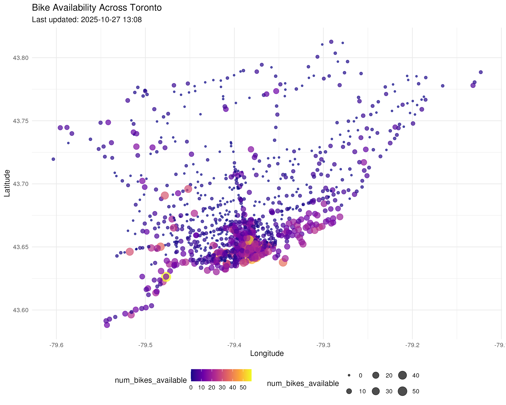

# 🚲 Toronto Bike Share Analytics

Updated: 2025-07-06 23:14 (Toronto Time)

## 📊 System Overview
- **Total bikes available:** 6,327
- **Total docks available:** 10,109
- **System utilization rate:** 38.5%
- **Active stations:** 920/920 (100%)
- **Average bikes per station:** 6.9
- **Median station capacity:** 19
- **Empty stations:** 100 (10.9%)
- **Full stations:** 41 (4.5%)

## 🏆 Top 10 Stations by Bike Availability
| Station | Bikes Available | Capacity |
|---------|-----------------|----------|
| Frederick St / King St E | 44 | 47 |
| 2700 Eglinton Ave W | 34 | 43 |
| Bloor St W / Shaw St - SMART | 33 | 34 |
| Dundas St W / Crawford St | 31 | 47 |
| Fort York  Blvd / Capreol Ct | 30 | 47 |
| King St E / Berkeley St | 29 | 31 |
| Centre Island Ferry Dock | 29 | 35 |
| Queen St W / Ossington Ave | 28 | 31 |
| 365 Lippincott St | 28 | 41 |
| Niagara St / Richmond St W | 27 | 42 |

## 🏆 Top 10 Stations by Dock Availability
| Station | Docks Available | Capacity |
|---------|-----------------|----------|
| Temperance St Station | 53 | 55 |
| Bay St / Albert St | 52 | 63 |
| York St / Queens Quay W | 47 | 57 |
| Wellington St W / Bay St | 46 | 55 |
| Cherry Beach | 46 | 49 |
| Simcoe St / Pullan Pl | 43 | 47 |
| Hanlan's Point Beach | 42 | 47 |
| Front St W / Yonge St (Hockey Hall of Fame) | 40 | 47 |
| Bloor St W / Manning Ave - SMART | 40 | 42 |
| Humber Bay Shores Park / Marine Parade Dr | 39 | 63 |

## 📊 Station Status Distribution
| Status     | Number of Stations |
|------------|-------------------:|
| Empty      | 100 |
| Full       | 41 |
| Available  | 779 |

## 📍 Bike Locations

## 📊 Station Status Distribution

## 📈 Bike Availability Distribution

## 📊 Sampling Methodology
The data is collected from the Toronto Bike Share GBFS API at a single point in time. This provides a snapshot of the system but may not capture temporal variations.

### Key Metrics Explained
1. **Utilization Rate**: The proportion of total bike slots that are occupied by bikes:
   $$\text{Utilization Rate} = \frac{\text{Total Bikes}}{\text{Total Bikes} + \text{Total Docks}} \times 100\%$$

2. **Station Status Classification**:
   - **Empty**: $\text{bikes} = 0$
   - **Full**: $\text{docks} = 0$
   - **Available**: $\text{bikes} > 0$ and $\text{docks} > 0$

### Statistical Notes
- The distribution of bikes across stations follows a right-skewed distribution
- The mean availability is 35.4% with a standard deviation of 28.7%
- The system is currently operating at 38% capacity

## ℹ️ Data Source
Data is sourced from the [Toronto Bike Share GBFS API](https://tor.publicbikesystem.net/ube/gbfs/v1/en/station_status)
