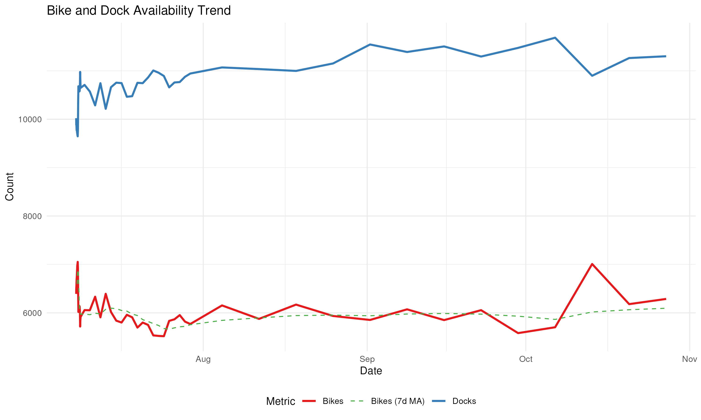

# 🚲 Toronto Bike Share Analytics

Updated: 2025-07-08 13:08 (Toronto Time)

## 📊 System Overview
| Metric | Value | Change |
|--------|-------|--------|
| **Total bikes available** | 6,044 | +21 |
| **Total docks available** | 10,666 | +3 |
| **System utilization rate** | 36.2% | +0.1% |
| **Active stations** | 922/922 (100%) | +1 |
| **Average bikes per station** | 6.6 | +0 |
| **Median station capacity** | 19 | - |
| **Empty stations** | 145 (15.7%) | -21 |
| **Full stations** | 33 (3.6%) | -1 |

## 🏆 Top 10 Stations by Bike Availability
| Station | Bikes Available | Capacity |
|---------|-----------------|----------|
| York St / Queens Quay W | 53 | 57 |
| Bay St / Albert St | 51 | 63 |
| Wellington St W / Bay St | 49 | 55 |
| Bremner Blvd / Rees St | 39 | 49 |
| Queens Quay / Yonge St | 39 | 46 |
| Simcoe St / Queen St W | 36 | 39 |
| 265 Armadale Ave | 34 | 44 |
| Front St W / Yonge St (Hockey Hall of Fame) | 33 | 47 |
| King St W / Bay St (West Side) | 31 | 38 |
| St. George St / Willcocks St | 30 | 35 |

## 🏆 Top 10 Stations by Dock Availability
| Station | Docks Available | Capacity |
|---------|-----------------|----------|
| Humber Bay Shores Park / Marine Parade Dr | 59 | 63 |
| 439 Sherbourne St | 45 | 47 |
| Dundas St W / Crawford St | 41 | 47 |
| Fort York  Blvd / Capreol Ct | 39 | 47 |
| Bloor St W / Manning Ave - SMART | 36 | 42 |
| Brimley Rd / Lawrence Ave E  | 36 | 39 |
| Bathurst St / Front St W | 35 | 35 |
| Bloor St W / Shaw St - SMART | 34 | 34 |
| Temperance St Station | 33 | 55 |
| Church St / Alexander St | 33 | 35 |

## 📊 Station Status Distribution
| Status     | Number of Stations |
|------------|-------------------:|
| Empty      | 145 |
| Full       | 33 |
| Available  | 744 |

## 📍 Bike Locations

## 📊 Station Status Distribution

## 📈 Bike Availability Distribution

## 📈 Historical Trends
### Bike and Dock Availability

### System Utilization Rate

## 📊 Sampling Methodology
The data is collected from the Toronto Bike Share GBFS API at a single point in time. This provides a snapshot of the system but may not capture temporal variations.

### Key Metrics Explained
1. **Utilization Rate**: The proportion of total bike slots that are occupied by bikes:
   $$\text{Utilization Rate} = \frac{\text{Total Bikes}}{\text{Total Bikes} + \text{Total Docks}} \times 100\%$$

2. **Station Status Classification**:
   - **Empty**: $\text{bikes} = 0$
   - **Full**: $\text{docks} = 0$
   - **Available**: $\text{bikes} > 0$ and $\text{docks} > 0$

### Statistical Notes
- The distribution of bikes across stations follows a right-skewed distribution
- The mean availability is 32.5% with a standard deviation of 28.9%
- The system is currently operating at 36% capacity

## ℹ️ Data Source
Data is sourced from the [Toronto Bike Share GBFS API](https://tor.publicbikesystem.net/ube/gbfs/v1/en/station_status)
